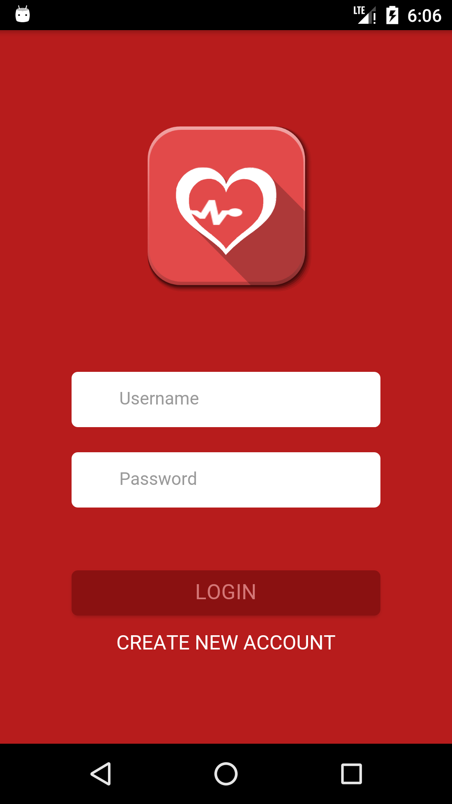
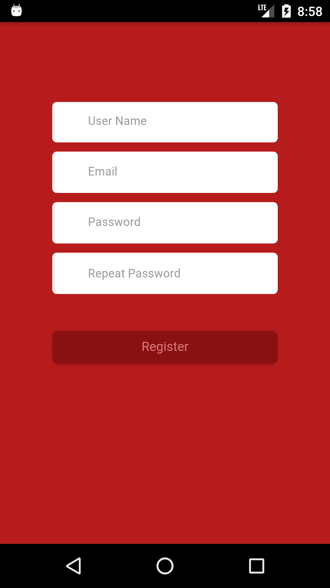

# Heart Link App User Manual
## 0. Contribute or Modify

1. If you like, please fork the [GitHub](https://github.com/zen-z0ri/Heart_Health) and contribute.
2.  The App is built by Ionic and Cordova. The test back-end is built by Node.js and MongoDB.
  * Node.js --> v8.4.0
  * npm  --> v4.2.0 
  * MongoDB --> v3.4.9
  * For more information please see ```Heart_healh/package.json ```, ```Heart_healh/server/package.json ``` and other config file.
3. Config environment:
  <br/>3.1 ```$ npm install``` at **Heart_healh** folder
  <br/>3.2 ```$ npm install``` at **Heart_healh/server** folder
  <br/>3.3 Start service of MongoDB.
  <br/>3.4 Start data base and insert test document: At **Heart_healh/server** folder, ```$ mongoimport --jsonArray --db heart --collection medicine --file sampleData1.json```,
  ```$ mongoimport --jsonArray --db heart --collection information --file sampleData.json```
  <br/>3.5 Start the server js at **Heart_healh/server** folder: ```$ node server.js```
  <br/>3.6 Start ionic build at **Heart_healh** folder: see [GitHub](http://ionicframework.com/) and [Cordova](https://cordova.apache.org/)
4. The issue you might have:
  * [Failed to connect to 127.0.0.1:27017, reason: errno:111 Connection refused](https://stackoverflow.com/questions/26211671/failed-to-connect-to-127-0-0-127017-reason-errno111-connection-refused)
  * [cordova run android executes fine. But Android doesn't start the app](https://stackoverflow.com/questions/29956031/cordova-run-android-executes-fine-but-android-4-1-2-doesnt-start-the-app)
  * [Could not install ‘node_modules/cordova-plugin-app-event’](https://forum.ionicframework.com/t/could-not-install-node-modules-cordova-plugin-app-event/106810)
  * ['mx.ferreyra.callnumber' is not in the npm registry.](https://github.com/Rohfosho/CordovaCallNumberPlugin/issues/47)

## 1. Login
Enter your password and user name to login:<br/>



If you don't have one, please Register.



## Overview
There are three tabs in this app:
* Medicine 
* Profile
* Setting

## 2. Medkit Page
The Medkit page includes the most frequently used
funcntion. This make the user can conviently attach the function


#### 2.1 Quick access set
In the head, it's a quick access set.
**Click** it to open and close


It has three tabs. 
* Top one is quick add medicine
  * It allows user scan barcode to add new medicine
  * 
* The right one is health monitor
  * 
  * It allows user to monitor the health data for last 7 input.
  * It includes heart rete, BMI, blood pressure and emotion.
* The left one is dynamic token
  * 
  * It will generate a dynamic QR code allows Doctor to access user's
    data. Through this way, The doctor can know want medicine the user use and the health data.
#### 2.2 Medicine List
**Press** the Medicine button to access the Medicine List.
More information at **5. Medicine List** functoin.

#### 2.3 Doctor Advice
**Press** the Doctor Advice button to access the Health Advice Articles.
We will frequently push u some health article that suit for you.

#### 2.4 User Manual
**Press** the DUser Manual button to access the Health Advice Articles.

## 3. Profile Page
* In the top, it's user's Doctor Profile card.
**Press** it to make a call to the Doctor.
* In the bottom, it's health info list. User can update their health information to server
and monitor it at **Health Monitor**;


## 4. Setting Page
It includes a Doctor botton to scan the users token to get that users information.


## 5. Medicine List
The figure below is a users' medicine list example.

* **Swap** it left to delete one medicine.
* **Press** it to access the medicine detail.
  * This allows your to set alarms to the medicine.

